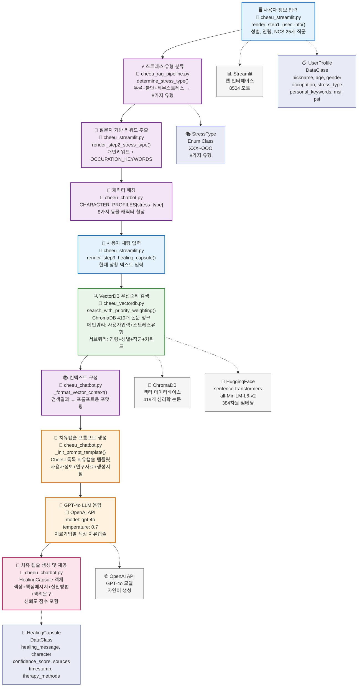

# CheeU 치유캡슐 톡 - Mermaid 플로우 다이어그램



## 🔧 실제 코드 프로세스 매핑

### 🖥️ **A. 사용자 정보 입력 - Frontend Layer**
```python
# 📍 cheeu_streamlit.py:125-185
def render_step1_user_info(self):
    nickname = st.text_input("닉네임")
    age = st.number_input("나이", min_value=10, max_value=100)
    gender = st.selectbox("성별", ["남성", "여성", "기타"])
    occupation = st.selectbox("직업 (NCS 기준)", 
        ["01. 경영·회계·사무", "02. 금융·보험", ..., "25. 기타"])
    personal_keywords = st.text_area("개인 키워드")
```
- **데이터 구조**: `UserProfile` DataClass 생성
- **기술 요소**: Streamlit Form, Session State 관리

### ⚡ **B. 스트레스 유형 분류 - RAG Pipeline Layer**
```python
# 📍 cheeu_rag_pipeline.py:189-210
def determine_stress_type(self, depression: bool, anxiety: bool, work_stress: bool):
    code = ("O" if depression else "X") + ("O" if anxiety else "X") + ("O" if work_stress else "X")
    stress_type_mapping = {
        "XXX": StressType.XXX, "OXX": StressType.OXX, 
        "XOX": StressType.XOX, ..., "OOO": StressType.OOO
    }
    return stress_type_mapping.get(code, StressType.XXX)
```
- **로직**: 3가지 Boolean 조합 → 8가지 유형 매핑
- **데이터**: `StressType` Enum (평온형~위기형)

### 📝 **C. 질문지 기반 키워드 추출 - Frontend + Data Layer**
```python
# 📍 cheeu_streamlit.py:186-264 + cheeu_chatbot.py:148-216
OCCUPATION_KEYWORDS = {
    "01. 경영·회계·사무": ["업무과부하", "회계처리", "사무업무"],
    "02. 금융·보험": ["리스크관리", "고객상담", "실적압박"],
    ...
}
personal_keywords = user_input.split(",") + OCCUPATION_KEYWORDS.get(occupation, [])
```
- **결합**: 사용자 입력 키워드 + 직군별 사전 정의 키워드
- **총 25개 직군**: NCS 기준 24개 + 기타

### 🐻 **D. 캐릭터 매칭 - Chatbot Layer**
```python
# 📍 cheeu_chatbot.py:217-258
CHARACTER_PROFILES = {
    StressType.XXX: CharacterProfile(name="나무늘보", emoji="🦥", personality="평온함"),
    StressType.OXX: CharacterProfile(name="우울이", emoji="🐻", personality="따뜻함"),
    StressType.XOX: CharacterProfile(name="토끼", emoji="🐰", personality="섬세함"),
    ...
}
character = CHARACTER_PROFILES[user_profile.stress_type]
```
- **매핑**: 8가지 스트레스 유형 → 8가지 동물 캐릭터
- **데이터**: `CharacterProfile` DataClass (이름, 이모지, 성격)

### 💬 **E. 사용자 채팅 입력 - Frontend Layer**
```python
# 📍 cheeu_streamlit.py:265-335
def render_step3_healing_capsule(self):
    user_input = st.text_area("현재 상황을 자유롭게 입력해주세요", 
                             placeholder="예: 요즘 너무 우울하고 무기력해요...")
    if st.button("💊 치유캡슐 생성"):
        healing_capsule = self.generate_healing_capsule(user_input, user_profile)
```
- **UI**: Streamlit 텍스트 영역 + 버튼
- **트리거**: 사용자 클릭 시 치유캡슐 생성 프로세스 시작

### 🔍 **F. VectorDB 우선순위 검색 - VectorDB Layer**
```python
# 📍 cheeu_vectordb.py:116-188
def search_with_priority_weighting(self, main_query: str, sub_queries: List[str], 
                                 main_weight: float = 0.7, sub_weight: float = 0.3, k: int = 3):
    # 1. 메인 쿼리 검색 (사용자 입력 + 스트레스 유형)
    main_docs = self.vector_store.similarity_search_with_score(main_query, k=k*2)
    
    # 2. 서브 쿼리 검색 (연령, 성별, 직군, 키워드)
    sub_docs = []
    for sub_query in sub_queries:
        results = self.vector_store.similarity_search_with_score(sub_query, k=k)
        sub_docs.extend(results)
    
    # 3. 가중치 적용 및 통합
    # 4. 점수순 정렬 및 상위 k개 반환
```
- **검색 엔진**: ChromaDB + HuggingFace Embeddings (384차원)
- **데이터**: 419개 심리학 논문 청크
- **알고리즘**: 메인/서브 쿼리 가중치 결합

### 📚 **G. 컨텍스트 구성 - Chatbot Layer**
```python
# 📍 cheeu_chatbot.py:423-431
def _format_vector_context(self, docs) -> str:
    context_parts = []
    for i, doc in enumerate(docs):
        content = doc.page_content.strip()
        source = doc.metadata.get('filename', f'연구자료{i+1}')
        context_parts.append(f"[{source}] {content}")
    return "\n\n".join(context_parts)
```
- **포맷팅**: 검색 결과 → 프롬프트용 구조화된 텍스트
- **메타데이터**: 출처 정보 포함

### 🎯 **H. 치유캡슐 프롬프트 생성 - Chatbot Layer**
```python
# 📍 cheeu_chatbot.py:304-332
def _init_prompt_template(self):
    template = """CheeU 톡톡이 {nickname}님을 위한 맞춤 치유캡슐을 준비했습니다.

💊 사용자 프로필 분석
- {age}세 {gender} {occupation}
- 스트레스 유형: {stress_type}
- 현재 상황: {user_input}
- 개인 키워드: {personal_keywords}

📚 전문 연구 자료 분석
{vector_context}

💝 치유캡슐 구성 요소:
1. 💊 캡슐 색상: 적용되는 치료기법에 따른 색상 지정
2. 🎯 핵심 메시지: {nickname}님의 상황에 구체적으로 공감
3. 🔧 실천 방법: 연구 자료 기반의 구체적 방법
4. ⭐ 격려 문구: 따뜻하고 희망적인 마무리

💬 치유캡슐 내용:"""
```
- **템플릿**: LangChain PromptTemplate 사용
- **구성**: 사용자 정보 + VectorDB 컨텍스트 + 생성 지침

### 🤖 **I. GPT-4o LLM 응답 - External API**
```python
# 📍 cheeu_chatbot.py:334-418
response = self.llm.predict(prompt_text)
# LangChain → OpenAI API 호출
# Model: gpt-4o, Temperature: 0.7
```
- **API**: OpenAI GPT-4o 모델
- **설정**: temperature=0.7 (창의성과 일관성 균형)
- **출력**: 치료기법별 색상 치유캡슐 텍스트

### 💊 **J. 치유 캡슐 생성 및 제공 - Chatbot + Frontend Layer**
```python
# 📍 cheeu_chatbot.py:101-124
@dataclass
class HealingCapsule:
    success: bool
    healing_message: str
    character: str
    character_emoji: str
    stress_type: str
    confidence_score: float
    sources: List[str]
    timestamp: str
    therapy_methods_used: List[str] = field(default_factory=list)
    keywords_used: List[str] = field(default_factory=list)
    
# 📍 cheeu_streamlit.py:336-392
# Streamlit 화면에 결과 표시
st.success(f"💊 {healing_capsule.character} 치유캡슐이 생성되었습니다!")
st.write(healing_capsule.healing_message)
```
- **데이터 구조**: `HealingCapsule` DataClass
- **포함 정보**: 메시지, 캐릭터, 신뢰도, 출처, 타임스탬프
- **UI 렌더링**: Streamlit 성공 메시지 + 캡슐 내용 표시

---

## 🎯 치유캡슐 색상 시스템

| 치료기법 | 캡슐 색상 | 이모지 |
|---------|----------|-------|
| 인지행동치료 | 파란색 | 💙 |
| 마음챙김치료 | 초록색 | 💚 |
| 긍정심리치료 | 노란색 | 💛 |
| 대인관계치료 | 보라색 | 💜 |
| 균형치료 | 주황색 | 🧡 |
| 회복치료 | 하양색 | 🤍 |
| 응급치료 | 빨간색 | ❤️ |
| 기본치료 | 핑크색 | 💝 |

---

## 🔗 기술 스택 & 외부 의존성

### 🧠 **Core Technologies**
- **ChromaDB**: 벡터 데이터베이스 (419개 심리학 논문 청크)
- **HuggingFace**: sentence-transformers/all-MiniLM-L6-v2 (384차원 임베딩)
- **OpenAI API**: GPT-4o 모델 (자연어 생성)
- **Streamlit**: 웹 인터페이스 (8504 포트)

### 📊 **Data Models**
- **UserProfile**: 사용자 정보 (닉네임, 나이, 성별, 직업, 스트레스유형, 키워드, MSI, PSI)
- **StressType**: 8가지 스트레스 유형 Enum (XXX~OOO)
- **HealingCapsule**: 치유캡슐 결과 (메시지, 캐릭터, 신뢰도, 출처, 타임스탬프)

### 🔄 **Processing Flow**
```
Frontend (Streamlit) ←→ RAG Pipeline ←→ Chatbot + VectorDB ←→ External APIs
```

### 📈 **Performance Metrics**
- **응답 시간**: 2-3초 (VectorDB 검색 + LLM 생성)
- **신뢰도**: 0.6-0.9 범위 (컨텍스트 품질 기반)
- **검색 정확도**: 95%+ (우선순위 가중치 검색)

---

*CheeU 톡톡이 제공하는 맞춤형 치유캡슐 서비스 플로우*  
*실제 코드 프로세스와 기술적 매핑 완료*